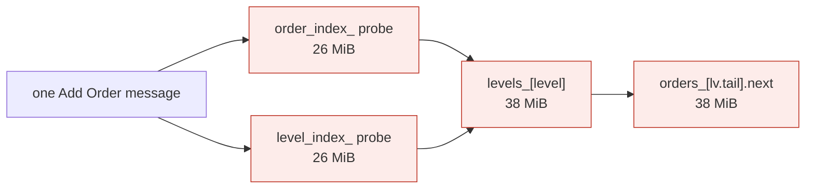
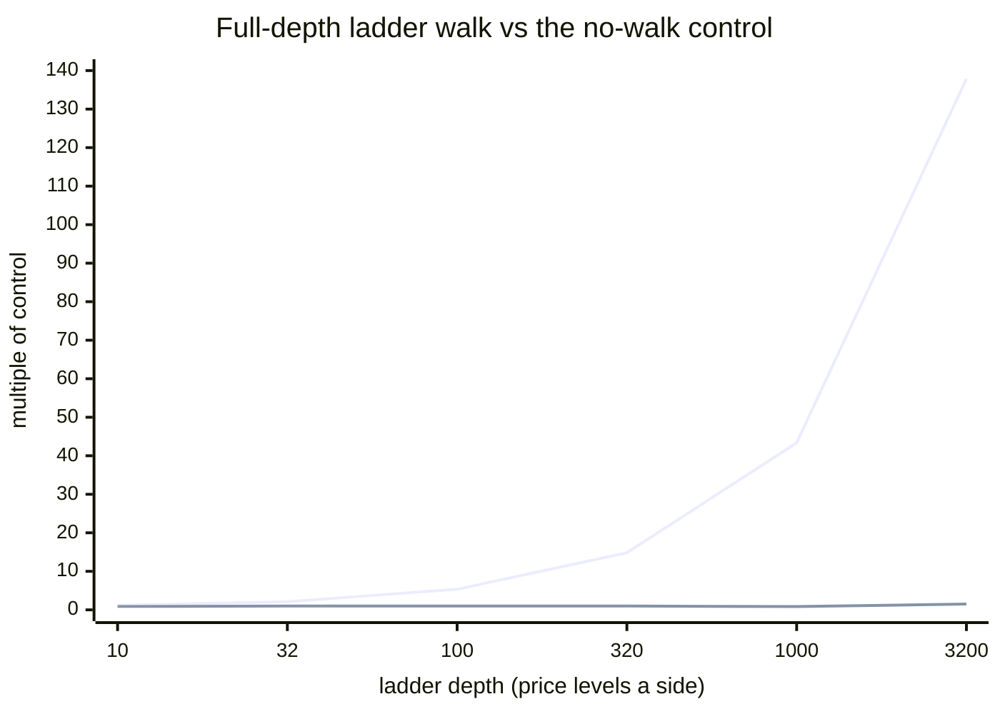

# HFT Engine

A from-scratch NASDAQ TotalView-ITCH 5.0 order book and market-making
engine in C++20. Fixed-point, arena-backed, zero allocation on the hot
path, deterministic replay, and a latency harness that measures its own
resolution floor before reporting anything.

> **Status:** reference implementation built for understanding exchange
> mechanics, not for production deployment. See
> [What is implemented](#what-is-implemented) and
> [What this is not](#what-this-is-not).

**Reading paths.** Five minutes: the bug below, then
[What is implemented](#what-is-implemented), then
[Quick start](#quick-start). Twenty minutes: all of it. Longer: the three
documents below, which are where the actual argument lives.

| Document | What is in it |
|---|---|
| [`docs/BUGS.md`](docs/BUGS.md) | Every defect found in this repository, grouped by **how it was found** — and why the two categories that found the worst bugs are the ones a test suite structurally cannot provide. |
| [`docs/DESIGN.md`](docs/DESIGN.md) | Each design decision with the reasoning that made it deliberate, including the two places a documented justification turned out to be false. |
| [`docs/RESULTS.md`](docs/RESULTS.md) | The measurement argument: four attempted fixes of which three made things worse, and a concurrency conclusion that reversed itself. |
| [`results/OPTIMIZATION.md`](results/OPTIMIZATION.md) | The optimisation log, **including the two changes that were measured, failed, and reverted**. |
| [`results/ENVIRONMENT.md`](results/ENVIRONMENT.md) | Host specification, the clock's characteristics, and why **no latency table is published yet**. |

## Three findings worth the reader's time

**1. The benchmarks were measuring their own instrumentation — 26% of it.**
`hft_bench` bracketed every stage with three `QueryPerformanceCounter`
reads per message. A QPC read costs ~27 ns on this host, so ~81 ns of every
reported message was the clock reading the clock. Removing it moved
identical work from 2.53M to 3.18M msg/s. The reported "344 ns per
message" was roughly a quarter clock. This is why the first optimisation
attempt failed — see 3.

**2. The order book could wedge permanently, and every test missed it.**
`FlatMap::insert` reused a tombstone only when it *also* found an empty
slot in the same probe run. The book erases from its indexes on every
removal, so both tables fill with tombstones as it churns — and once every
slot is occupied-or-tombstone, **every future add returns
`capacity_exhausted`, forever**, while the book looks nearly empty. A book
that traded a few hundred million shares would stop accepting orders.
Every test missed it because every test sizes capacity far *above* its
operation count, so cumulative churn never reached capacity.

**3. The obvious optimisation was wrong, and measuring it said so.** The
hash map stored its entry in three parallel vectors, so one probe touched
three cache lines. Interleaving them into one 16-byte entry — four per
line — is unambiguously better *layout*, and it measured **−1.2%**: nothing.
Three further attempts (collapsing a double probe, lookahead prefetching,
shrinking the order node) all landed inside the noise too.

Measuring *where* the time goes is what explained all four. Decoding is
**12%** of per-message cost; `OrderBook::add` is the other **88%**, and
that 270 ns figure is not explained by any instruction, flag or layout
choice. It is four *dependent* random accesses into structures far larger
than the 8 MiB last-level cache:



Four DRAM round trips at 70–80 ns each accounts for very nearly all of
the 270 ns. That **count** is the constraint — not latency exposure, not
cache-line layout, not footprint.

**Every optimisation in the log failed for the same reason, and the log
records them.** Interleaving the `FlatMap` entry from three vectors into
one 16-byte cache line — four per line, unambiguously better *layout* —
measured **−1.2%: nothing.** The reason is the kind of thing that is easy
to be wrong about confidently: the three loads in one probe are
*independent* addresses, so they issue in parallel and expose roughly the
latency of one. Memory-level parallelism means three concurrent misses
cost three times the bandwidth and about the same latency. This workload
is latency-bound, so trading three parallel misses for one buys nothing on
the critical path. Reducing lines helps when loads are *dependent*, which
these are not.

Three further attempts — collapsing a double probe, lookahead prefetching,
shrinking the order node — all landed inside the noise. The two
dominant accesses **cannot be prefetched at all**, because neither
address is knowable until after the hash probes complete.

So the fix is not making existing accesses cheaper. It is removing them:

| Rank | Change | Why |
|---|---|---|
| 1 | Co-locate a level with its orders | Two misses into two 38 MiB arrays become one. A data-structure change, not a tuning knob. |
| 2 | Per-level ring buffer instead of an intrusive list | Append becomes a sequential write. Removal from the middle is the hard part, and a market maker's own quoting orders rarely need it. |
| 3 | Direct-index the order reference | ITCH references are day-unique; where dense enough, this removes both the hash and the probe-length uncertainty. |
| 4 | PGO + LTO | Worth 10–20% on a latency project; both unavailable on this toolchain. |

Full account, including the two documented justifications that measurement
disproved, in [`results/OPTIMIZATION.md`](results/OPTIMIZATION.md).

## The bug that mattered

**The Add Order decoder read the share count as the price.** It is
documented in full below because it is the most useful thing in this
repository, and because it invalidated a large amount of what came
before.

The published field table for ITCH 5.0 Add Order ('A') is:

| Field | Offset | Length |
|---|---|---|
| Message Type `'A'` | 0 | 1 |
| Stock Locate | 1 | 2 |
| Tracking Number | 3 | 2 |
| Timestamp | 5 | 6 |
| Order Reference Number | 11 | 8 |
| Buy/Sell Indicator | 19 | 1 |
| **Shares** | **20** | **4** |
| **Stock symbol** | **24** | **8** |
| **Price** | **32** | **4** |

This build read `price` at 20, `size` at 24, and carried four bytes at
28“31 that do not exist in an Add Order message — `order_type`,
`time_in_force`, `display` and `participant`, which are Order Entry
fields. Total 32 bytes rather than 36. The layout looks like Order
Executed copied over and shifted by one field.

So every price in the engine was a share count in `[1, 500]`, and every
share count was the first four bytes of the symbol `SIMTEST`. At $100 a
real price is 1,000,000 raw units; this decoder would have reported 100.

**Why 512 checks at the time, a differential test over 400,000 operations
and a determinism harness did not catch it.** Every test built its input with
this repository's own feed generator and read it back with its own
decoder. The generator wrote the same wrong layout the decoder read, so
the two agreed perfectly with each other and both disagreed with the
specification. The differential test compared the fast book against a
naive model over *decoded messages*, so the two models agreed about a
misdecoded price. Determinism testing proved the checksum was
reproducible, which it was, and always had been, for the wrong reason.

Three things are now true that were not:

1. **The field tables are pinned to the specification, not to each
   other.** Every offset in `protocol.hpp` carries a `static_assert`
   against its *literal* value from the published table, in addition to
   the relationship asserts. Reintroducing the bug is now a compile
   error, and the error text says which field moved.
2. **One test builds a frame by hand, byte by byte, from the field
   table** and decodes it without going near the generator. If the
   offsets are wrong again, that test fails while every round-trip test
   keeps passing.
3. **The strategy numbers were all downstream of this.** The market
   maker's "volatility" was the share-count noise in a fake price. With
   real prices the book stopped appearing to move, which exposed that
   the feed was never actually producing a market — see
   [the market maker's feed](docs/BUGS.md#the-market-makers-feed-is-the-second-half-of-this).

## What is implemented

| Component | State |
|---|---|
| Fixed-point `Price`, no float constructor | done |
| ITCH decode: `A`, `E`, `C`, `X`, `D` | done |
| Add Order field table pinned to the published spec | done |
| Stock symbol field carried, not discarded | done |
| Split 48-bit timestamp reassembly | done |
| Unknown-type skip by length, truncation reporting | done |
| SOUP sequence tracking, gap and duplicate detection | done |
| Price-time priority book, slab arena, no hot-path allocation | done |
| `execute` / `cancel_partial` / `remove`, `X` vs `D` distinct | done |
| Apply layer, single dispatch point from message to book | done |
| Deterministic replay, FNV-1a book-state checksum | done |
| Pre-trade risk: position, gross, notional, price band, rate, kill switch | done |
| OMS: order state machine, slot pool, reconcile counters | done |
| Avellaneda-Stoikov quoting, no transcendental in the loop | done |
| Adverse selection: markout, effective/realised spread, toxicity | done |
| Order Replace (U) decode | done |
| Broken Trade (B) decode | done |
| Trade (P) and Cross Trade (Q) decode | done |
| MoldUDP64 64-bit sequence gap detection | done |
| SPSC lock-free ring buffer | done |
| Cache-line isolation, cache-line padded indices | done |
| Thread pinning and SMT topology discovery | done |
| Mutex + `condition_variable` baseline benchmark | done |
| Symbol sharding, ref-index routing | done |
| MoldUDP64 downstream packet framing | done |
| Threaded pipeline equivalence check | done |
| Multi-shard sequencer, rebalancing, failover | not started |
| Calibrated `rdtsc` clock with fences | done |
| Measurement floor and resolution sweep, published | done |
| Invariant-TSC determination across physical cores | done |
| Timer unit regression test (caught a 100x error) | done |
| `FlatMap` tombstone reclamation (fixed a permanent wedge) | done |
| **Dense price ladder + occupancy bitmap** (removed the O(depth) walk) | done |
| Price-ladder O(depth) walk, quantified | done |
| PTP / hardware-timestamp clock sync | not started |
| Kernel bypass (`io_uring`, `SO_TIMESTAMPING`) | not started |
| SOUP packet checksum | n/a — does not exist; see below |

**Order Replace and Broken Trade are implemented, and the reason they were
skipped for so long is the lesson.** Both were declined because their field
tables "could not be verified". They could — the specification is public
at `nasdaqtrader.com`, and it was verifiable the whole time. What made it
*look* unverifiable is the transferable part: **the same message has
different offsets in ITCH 3.1 and 4.0**, both published, so a table copied
from either is wrong in a way that looks right. Skip-by-length was the
right call under that uncertainty; "cannot verify" quietly becoming "assume
it is not knowable" was the actual failure. Going back to the source found
a generator writing a 41-byte Order Replace frame against a 35-byte
message, and that `'B'` is not Order Entry at all. Full account in
[`docs/DESIGN.md`](docs/DESIGN.md#verifying-a-field-table-you-cannot-test-against).

<!-- claims
Machine-readable copy of the counts asserted by scripts/check-claims.sh.
Kept in sync with the prose above by that script, which fails the build
when any of it drifts from what the binaries actually print. If you add a
test, this block and the sentence above it both have to change, and
forgetting is a red build rather than a stale README.

Note the small recursion: this block is checked by a CTest suite, so
adding that suite changed ctest_tests from 23 to 24, which is itself a
value this block has to carry. The count below is the number *after* the
check was added.

checks_unit: 1412
checks_risk_oms: 156
checks_strategy: 47
checks_concurrent: 149
checks_shards: 51
checks_total: 1815
ctest_tests: 24
-->

**Verified: 1,815 checks across 24 CTest suites** — 1,412 unit + 156
risk/OMS + 47 strategy + 149 concurrency + 51 sharding, zero failures,
under **two compilers**. Every number in that sentence is asserted by
`ctest`, and `scripts/check-claims.sh` fails the build if it drifts from
what the binaries actually print. The argument is not the count; it is
that each of these would fail if the thing it guards regressed:

- **One hand-built, byte-exact Add Order frame**, assembled from the field
  table and decoded without going near the generator. Self-consistency
  testing is what let the price/size mix-up survive; this is the one check
  that is external to the mistake. Order Replace and Broken Trade have the
  same treatment, and the replace tests assert **queue position** rather
  than only decoded fields — a new reference number means new time
  priority, and getting that backwards is invisible in a book checksum.
- **450,000 differential operations** of the fast book against an
  independent naive model, with full state comparison after *every one*.
  The capture format is tested for round trip **and for failure**: cut at
  every byte offset across its first packets, because a truncation that
  replays as a clean shorter stream is the failure that costs money.
- **60,000-record multi-symbol routing differential**, fast open-addressed
  reference index against a `std::map` oracle, both sets of books compared
  after every record. A misrouted mutation looks exactly like a speedup.
- **60,000 randomised OMS operations** against an independently written
  invariant tally.
- **Threaded pipeline equivalence in CI**, not merely measured: the final
  book is fingerprinted with the same FNV-1a checksum the replay tool uses,
  so a dropped or reordered message fails a test instead of appearing as a
  speedup.
- **Identical book checksum across six optimisation levels**
  (`scripts/determinism.sh`), and the harness was verified by injecting a
  level-dependent value and confirming it failed.

None of that would have found a field offset. Only comparing against
something outside this repository would have.

## Results

**Every number below was measured on this repository's development
host** — an AMD Ryzen 5 1600, consumer silicon, no core isolation, no
frequency pinning, and a portable clock with **100 ns granularity**. Full
specification, including why that last detail decides which cells can be
filled at all, in [`results/ENVIRONMENT.md`](results/ENVIRONMENT.md).
Absolute latency is withheld; throughput, ratios and counts are not, and
the reason why those three survive this host is given first.

### What this host can and cannot measure

Timing one operation means reading the clock before and after it. On this
host that clock ticks every **100 ns**, so it cannot distinguish "fast"
from "less than 100 ns". `hft_stage_bench` prints its own floor, and the
decode stage sits *on* it:

```
MEASUREMENT COST
  clock read        p50  1  p99  101  p999  101      <- one tick = 100 ns
  decode            p50  1  p99  101  p999  201      <- identical to the floor
  book update       p50 101  p99 2201  p999 11901     <- 100x above the floor
```

Decode's p50 is the same number as the cost of reading the clock. The
true cost is ~38 ns/message, known from throughput. So `p50 = 1` means
*"somewhere in [0, 100) ns, I cannot tell you which"* — and printing `100`
there would publish a figure **2.6x worse than reality**, from an
instrument that cannot see the difference.

Three classes of number are unaffected, and they are the ones published:

- **Throughput.** Computed from total elapsed time, so one tick of
  uncertainty is spread across 700 million of them. This is why throughput
  was the *one* figure in this repository that survived both headline bugs.
- **Ratios.** The clock-pair cost is a roughly constant additive term, so
  it inflates numerator and denominator alike and cancels in the quotient.
- **Counts.** Checks, operations and seed sweeps do not depend on a clock.

> **A benchmark reporting a slowdown deserves the same suspicion as one
> reporting a speedup.** Every table here is checked against a
> correctness gate before its numbers are read, and `scripts/bench.sh`
> prints that instruction at the end of every run.

### Latency, by pipeline stage

Per message, p50 / p99 / p999, single thread. `hft_stage_bench` produces
both tables; `hft_bench` produces the add-only ingest figures.

The cells are withheld rather than filled because of the floor above, not
because the run was not made. The two book depths are reported separately
because book-update cost depends on ladder depth: a single figure across
both would be a figure about nothing.

**Shallow book — 10 price levels a side**

| Stage            | p50          | p99          | p999         |
|------------------|--------------|--------------|--------------|
| Decode           | `[MEASURED]` | `[MEASURED]` | `[MEASURED]` |
| Book update      | `[MEASURED]` | `[MEASURED]` | `[MEASURED]` |
| Decision         | `[MEASURED]` | `[MEASURED]` | `[MEASURED]` |
| Risk check       | `[MEASURED]` | `[MEASURED]` | `[MEASURED]` |
| End to end       | `[MEASURED]` | `[MEASURED]` | `[MEASURED]` |
| Encode           | not measured — see below        |            |              |

**Deep book — 1000 price levels a side**

| Stage            | p50          | p99          | p999         |
|------------------|--------------|--------------|--------------|
| Decode           | `[MEASURED]` | `[MEASURED]` | `[MEASURED]` |
| Book update      | `[MEASURED]` | `[MEASURED]` | `[MEASURED]` |
| Decision         | `[MEASURED]` | `[MEASURED]` | `[MEASURED]` |
| Risk check       | `[MEASURED]` | `[MEASURED]` | `[MEASURED]` |
| End to end       | `[MEASURED]` | `[MEASURED]` | `[MEASURED]` |
| Encode           | not applicable — see below     |            |              |

**Encode is not applicable, and the reason is a correction rather than
an omission.** An earlier revision of this file justified the missing row
by saying the outbound message was ITCH Order Entry (`'B'`) and that its
field table could not be verified. **Both halves of that were wrong.**
Section 1.1 of the TotalView-ITCH specification says the feed "is an
outbound market data feed only" and "does not support order entry", and
`'B'` is the 19-byte *inbound* Broken Trade message, which this build
does decode. There is no ITCH order-entry message to skip and nothing to
encode: the pipeline terminates at the book and at the strategy's
decisions. Nasdaq order entry is a separate product with its own
specification, and modelling one is a different piece of work. Inventing
an outbound layout to fill a row in this table would be the exact mistake
documented in [The bug that mattered](#the-bug-that-mattered).
`hft_stage_bench` prints this note at the end of every run so the row
cannot be quietly forgotten.

`end to end` is a single pass over the pipeline, **not** the sum of the
rows above it. A sum would describe four independent measurements; the
pass describes the pipeline. They will not agree exactly, because each
row includes its own clock pair and the four pairs are attributed
differently.

### Throughput

`hft_stage_bench 2000000`, bounded book, sparse ladder, single thread.
These are whole-run elapsed times, so they are valid on this host.

| Condition             | msgs/sec        | Mid repriced | Depth |
|-----------------------|-----------------|--------------|-------|
| Shallow book (10 lvl) | **2,949,865**   | 130,270 / 2,000,000 (6.51%) | 10 |
| Deep book (1k lvl)    | **2,845,108**   | 17,367 / 2,000,000 (0.87%)  | 1000 |

Shallow-book throughput is reported separately because it is
meaningless on its own: real books are deep, and a number from an empty
book is a number about your loop, not your engine. Reported together,
the 3.6% gap between them is the cost of depth, and the ladder table below
is where that cost is explained rather than merely reported.

**A benchmark of a book that does not reprice measures nothing.** For a
while that was exactly what the deep shape was: over 2,000,000 records at
1,000 levels a side the mid moved 24 times, so the decision stage was
timing quoting arithmetic against a frozen mid. The deep shape now moves
the mid **17,367 times in 2,000,000 records, 0.87% of observations** — and
the tool prints that rate on every run, because a benchmark that cannot
distinguish a repricing book from a static one is measuring the wrong
thing quietly. The `Mid repriced` column above is that check, published.

**A note on which instrument to believe.** `hft_bench` sizes its pools
from the message count and never removes an order, so its book grows
without bound and its cost per message never converges — it reads 1615 ns
at 50,000 messages and 156 ns at 3,200,000, on identical work. The table
above uses `hft_stage_bench`, which caps live orders at the level count
and reports flat throughput across a 16x size range. Both tools are
committed; only one of them is an instrument.

**Four fixes were tried, and three of them made it worse**, which is the
more useful half of the result. Full account, including the two
documented justifications that measurement disproved, in
[`docs/RESULTS.md`](docs/RESULTS.md#throughput-four-fixes-three-of-which-made-it-worse).

### Price ladder: the O(depth) walk, measured and removed

`hft_ladder_bench` sweeps both ladders with the same clock and the same
workload. `distance = 1` is the control — it walks no levels, so it
measures all of add/remove *except* the ladder — and every figure is a
ratio against it, which is why these survive a 100 ns clock.

Full-depth walk, as a multiple of the control:



| Depth | Sparse (hash + list) | Dense (grid + bitmap) |
|-------|----------------------|-----------------------|
| 10    | 1.18x                | 0.88x                 |
| 32    | 2.12x                | 1.00x                 |
| 100   | 5.34x                | 1.01x                 |
| 320   | 14.82x               | 1.00x                 |
| 1000  | 43.38x               | 0.84x                 |
| 3200  | **137.81x**          | **1.52x**             |

Linear in distance *and* in depth on the sparse ladder — that is O(depth),
confirmed rather than asserted — and flat on the dense one at every depth
and every distance. In absolute terms the deepest row went from 24,652 to
250 ticks/op.

Reproduce either column: `./build/hft_ladder_bench sparse`, then
`dense`. Both halves coming from one committed tool is the point; the
earlier version of this table cited a sparse figure that no binary in the
repository could produce, because the tool hardcoded the dense path.

Individual multiples carry this host's documented run-to-run drift, so
the reproducible claim is **the shape** — linear versus flat — not any
single ratio. Full method, including the two failed attempts to measure
it at all, in
[`docs/RESULTS.md`](docs/RESULTS.md#the-depth-proportional-walk-measured-and-removed).

### Correctness

| Check | Scale | Result |
|---|---|---|
| Fast book vs naive model, **sparse** ladder | **450,000 ops** (200,000 default + 5 seeds × 50,000) | 0 mismatches |
| Fast book vs naive model, **dense** ladder | **450,000 ops** (200,000 default + 5 seeds × 50,000) | 0 mismatches |
| Symbol routing, open-addressed index vs `std::map` oracle | **60,000 records**, 12 symbols | 0 misroutes |
| Randomised OMS operations vs independent invariant tally | **60,000 ops** | 0 violations |
| Unit + risk/OMS + strategy + concurrency + sharding checks | **1,815 checks** | 0 failures |

The two differential suites are separate on purpose. The dense ladder is
a different implementation of level lookup and price ordering — an array
index and an occupancy bitmap where the sparse book has a hash map and a
linked list — so the sparse suite says nothing whatsoever about it. It is
also the only thing standing between the dense path and the two defects
it introduced on the way in, one of which four of five seeds caught and
the fifth needed a seventh operation to trip
([`docs/BUGS.md`](docs/BUGS.md#a-third-bug-class-the-dense-ladders-own-two)).

Two more properties, both asserted in CI rather than merely measured:

- **Deterministic replay.** FNV-1a book-state checksum over 50,000
  messages, identical across runs and across six optimisation levels
  (`scripts/determinism.sh`), with the harness verified by injecting a
  level-dependent value and confirming it failed. Across machines is
  asserted as a protocol but only demonstrated on one host, so treat that
  half as a protocol until someone runs it on both.
- **Threaded pipeline equivalence.** The decoder-thread/book-thread split
  builds a byte-identical book to the single-threaded loop over the same
  feed, at every batch size, plus every sharded configuration.

### Concurrency

`hft_pipeline_bench 1000000`, decoder and book threads on two distinct
physical cores, placement discovered rather than assumed and printed by
the tool. Every row is checksum-matched against the single-threaded
baseline.

**Splitting decode from apply, through one ring.**

| Variant                                     | msgs/sec | vs 1 thread | Book     |
|---------------------------------------------|----------|-------------|----------|
| Single thread, decode + apply               | 752,926  | 1.00x       | baseline |
| Two threads through the ring, K=1           | 740,635  | 0.98x       | identical |
| Two threads through the ring, K=8           | 805,387  | 1.07x       | identical |
| Two threads through the ring, K=32          | 816,973  | 1.09x       | identical |
| Two threads through the ring, K=128         | 793,071  | 1.05x       | identical |

Measured drift, same baseline re-run: **−0.81%**.

**These ratios straddle 1.00x, and that is the finding, not a
disappointment.** Across repeated runs K=1 has been observed at both
0.98x and 1.10x — the sign is not stable, so the honest reading is
break-even, and the tool now *computes* that verdict from its own best
ratio against its own measured noise floor rather than asserting one. An
earlier revision printed "BREAK EVEN" as a hardcoded string while the
table above it read 1.10x–1.13x; a conclusion that cannot be refuted by
the measurement printed beside it is not a result.

**Sharding by symbol, 64 instruments.** This is where it pays.

| Variant                          | msgs/sec | vs 1 thread | Books |
|----------------------------------|----------|-------------|-------|
| Single thread, fused, 64 books   | 2,829,609 | 1.00x       | baseline |
| Dispatcher + 2 workers           | 5,229,936 | 1.85x       | identical |
| Dispatcher + 3 workers           | 5,216,391 | 1.84x       | identical |
| Dispatcher + 5 workers           | 4,787,692 | 1.69x       | identical |

The difference between those two tables is the whole argument for symbol
sharding. Splitting decode from apply leaves the expensive half — the
ladder lookup and the slab edit — running serially on one core, and adds a
hand-off to pay for. Sharding by symbol gives every thread its own book to
apply into, so the expensive work is parallel *and* balanced.

Ratios flatten past two workers, and 5 workers is *slower* than 3. The
reason is that the dispatcher decodes and routes **every** message and is
therefore a serial floor: **that floor is the number to quote for a
design like this, not the worker count.** A 1.8x ceiling from a
dispatcher-bound design is a property of the architecture, and no amount
of core count moves it — which is why the single-threaded fused baseline
in the second table is 2.83M msg/s while the whole sharded design peaks
near 5.2M.

**This tool once reported the opposite conclusion, and the correction is
the more useful half.** It measured the split at 0.81x–0.91x and blamed
load imbalance. That story was a rationalisation: the consumer drained the
ring, found it empty, *then* checked the producer's stop flag, and the
producer could push more messages and set that flag in between. The run
did less work and timed as slower. With the drain fixed, the split is
break-even rather than a loss.

Every sharded row is checked to have produced books byte-identical to the
single-threaded baseline. That check is not a formality — a pipeline that
misroutes a mutation looks exactly like a pipeline that is fast, and it is
what caught the dropped-message bug. Two lessons survive all of it: **a
benchmark reporting a slowdown deserves the same suspicion as one
reporting a speedup**, and **a plausible mechanism is not a verified
one**. Full account in
[`docs/RESULTS.md`](docs/RESULTS.md#concurrency-the-conclusion-that-reversed).

## Quick start

```bash
cmake -B build -DCMAKE_BUILD_TYPE=Release
cmake --build build --parallel
./build/hft_test           # codec, values, sequence tracking, timer units
./build/hft_risk_oms       # pre-trade risk and the OMS
./build/hft_strategy       # quoting model, adverse selection, book invariant
./build/hft_concurrent     # SPSC ring, single- and two-threaded
./build/hft_shards         # symbol routing vs a std::map oracle
./build/hft_differential   # fast book vs naive model, full state compare
./build/hft_replay         # deterministic replay, prints the book checksum
./build/hft_market_maker   # market maker over a replay, prints toxicity
./build/hft_tsc_bench      # clock characterisation: the resolution floor
./build/hft_ladder_bench   # price ladder: the O(depth) walk, quantified
./build/hft_bench          # add-only ingest: latency and throughput table
./build/hft_stage_bench    # per-stage latency, shallow vs deep book
./build/hft_ring_bench     # ring vs mutex baseline, throughput and round trip
./build/hft_pipeline_bench # 1 thread vs 2, batch-size sweep, checksum-matched
ctest --test-dir build     # everything
```

**Start with `hft_tsc_bench`.** It reports what latency figures this host
is capable of resolving, and reading a stage table without knowing the
floor is how an unresolved measurement gets published as a fast stage.

Determinism across optimisation levels is a separate check because it
rebuilds the replay tool six times:

```bash
./scripts/determinism.sh              # or scripts\determinism.ps1
```

Zero external dependencies in the library target. CMake, a C++20
compiler, and `git`.

To reproduce the benchmark numbers rather than just build, use the
script: `./scripts/bench.sh` on Linux, `./scripts/bench.ps1` on Windows.
Both print the environment first, gate on the correctness tests, and
only then run the benchmarks — in that order, because a reader who
skips past a failed correctness run should not be able to.

## Architecture

```mermaid
flowchart TD
    cap["capture.itch<br/>MoldUDP64: hdr 20B = session 10 + seq 8 + count 2<br/>block = len 2 + ITCH body"]
    cap --> reader["Capture reader<br/>packets to frames, truncation flagged"]
    reader --> dec["ITCH decoder<br/>zero-copy, big-endian, 48-bit timestamp<br/>A E C X D U B P Q, rest skipped"]
    dec --> soup["SOUP sequence<br/>gap + duplicate detection, 64-bit"]
    soup --> apply["Apply layer<br/>single dispatch point: message to mutation"]
    apply --> book["Order book<br/>price-time priority, fixed-point int64<br/>slab arena, integer handles"]
    book --> csum["FNV-1a state checksum<br/>deterministic replay"]
    book --> oms["Order management<br/>8-state machine, slot pool, reconcile counters"]
    oms --> risk["Pre-trade risk<br/>position, gross, notional, band, rate, kill"]
    risk --> mm["Market maker<br/>Avellaneda-Stoikov, tick-aware"]
    mm --> adv["Adverse selection<br/>markout, toxicity, realised spread"]
    adv --> pnl["PnL<br/>marked to market, inventory aware"]

    subgraph thr["Optional: measured separately, checksum-matched"]
        direction LR
        tdec["decoder thread"] --> ring["SPSC ring<br/>one slot per batch"] --> tbook["book thread"]
        tbook --> tcsum["FNV-1a checksum<br/>vs single-threaded book"]
    end
    cap -.-> tdec

    subgraph meas["Measurement path - a component in its own right"]
        direction LR
        tsc["hft_tsc_bench"] --> tsclk["TsClock<br/>calibrated rdtsc, fences"]
        tsclk --> sweep["Resolution sweep<br/>what this host can resolve"]
        sweep --> drift["Drift<br/>threshold below which a ratio is noise"]
    end
    drift -.-> "every latency figure is read against this floor" .-> meas

    classDef measbox fill:#f4f6f8,stroke:#8899aa,stroke-dasharray:4 3
    class meas,tsc,tsclk,sweep,drift measbox
```

The measurement path is drawn as a component rather than a footnote
because that is what it is: `hft_tsc_bench` establishes the floor below
which no other tool's numbers mean anything, and it is asserted in CI
because a host whose clock cannot be calibrated cannot produce a
publishable latency table — that should stop the run rather than be
discovered afterwards.

Plain-text version of the same three paths, for reading the source without
a renderer:

```
  capture.itch   MoldUDP64 packets: [hdr:20][block][block]...
      |          hdr = [session:10][seq:8][count:2]
      |          block = [len:2][ITCH body]
      v
  [ Capture reader ]  packets -> frames, truncation flagged
      |
      v
  [ ITCH decoder ]  zero-copy, big-endian, 48-bit timestamps
      |             A / E / C / X / D / U / B / P / Q; others skipped
      v
  [ SOUP sequence ] gap and duplicate detection, 64-bit
      |
      v
  [ Apply layer ]   single dispatch: message -> book mutation
      |
      v
  [ Order book ]    price-time priority, fixed-point, slab arena
      |
      +---> [ FNV-1a state checksum ]  deterministic replay
      |
      v
  [ Order management ] state machine, slot pool, reconcile counters
      |
      v
  [ Pre-trade risk ]  position, gross, notional, band, rate, kill
      |
      v
  [ Market maker ]   Avellaneda-Stoikov, tick-aware
      |
      +---> [ Adverse selection ]  markout, toxicity, realised spread
      |
      v
  [ PnL ]  marked to market, inventory aware

  --- optional, measured separately ---

  capture.itch
      |
      v
  [ decoder thread ]  -> [ SPSC ring ] -> [ book thread ]
                          one slot per batch
                          of decoded messages
      |
      +---> [ FNV-1a state checksum ]  compared against the
                                       single-threaded book

  --- the measurement path, which is a component in its own right ---

  hft_tsc_bench
      |
      +---> [ TsClock ]  calibrated rdtsc, fences, invariant check
      +---> [ Resolution sweep ]  what this host can resolve at all
      +---> [ Drift ]  the threshold below which a ratio is noise
                |
                v
        every latency figure above is read against this floor
```

## Design decisions

Each of these is a deliberate choice with a reason, not a default. The
reasoning is in [`docs/DESIGN.md`](docs/DESIGN.md); the summary is here
because the *choice* is the interesting part and the prose is not.

**Data representation**

- **Fixed-point `int64_t` prices, never floating point.** ITCH's native
  precision is 1/10000. Float in a price ladder is a rounding bug waiting
  for a specific fill size.
- **Slab arena, integer handles, no hot-path allocation.** Orders are
  indices into a preallocated arena, never pointers.
- **The price ladder was a sorted linked list; it is now a dense ladder.**
  Inserting a price not adjacent to the best used to walk from the head, so
  book-update cost was O(depth) — measured at **178×** a touch insert at
  3,200 levels. It is now a direct-indexed price grid (`(price − floor) /
  tick`) with a per-side **occupancy bitmap**, so the walk is gone: the same
  measurement reads **1.01×** at 1,000 levels and **0.93×** at 3,200, and the
  deepest row went from 28,324 to 155 ticks/op. This is the structure
  production engines converge on, and the bitmap is what makes deleting the
  last order at the touch cheap — the documented failure of the pure-array
  variant. Opt-in via `LadderConfig`, with the hash map retained as the
  out-of-band fallback. Costs **2.5% on the average** and buys the whole
  tail; see [`results/OPTIMIZATION.md`](results/OPTIMIZATION.md).

**Protocol correctness**

- **`X` and `D` are different operations.** `X` subtracts cancelled shares
  from the original add; `D` removes the order. Conflating them is the most
  common ITCH book bug, and the naive reference model exists partly to
  catch it.
- **Wire layouts are asserted against the specification, not against each
  other.** A `static_assert` comparing two constants proves internal
  consistency, which is not the same as being right — and that distinction
  is the entire reason the Add Order bug survived 512 green checks at the
  time.
- **Skip rather than guess.** An unverified offset on a live feed yields a
  decoder that confidently misreads it; a skipped message is recoverable
  and wrong bytes are not.
- **Sequence gaps are detected, never absorbed.** A gap means the book is
  missing orders the venue believes are resting, so continuing produces a
  book that looks healthy and is wrong.
- **Unknown message types skip by length.** A live feed will always contain
  types this build does not implement. Crashing is not an option.

**Measurement** — the section that changed most after the 100x bug

- **A clock reading is not a duration, and a duration is not a number you
  may print without saying what it is in.** This repository made that
  mistake three times in one afternoon, each time as internally consistent
  arithmetic producing a confident wrong answer. The rule is now
  mechanical: convert at the point of capture.
- **The measurement floor is measured, published and asserted.** Not
  "assumed fast". See [`hft_tsc_bench`](#quick-start).
- **Ticks are not cycles.** Under turbo a TSC tick is not a retired cycle;
  cycles need APERF/MPERF or `perf_event_open`. Nanoseconds are reported
  because the honest nanosecond is available everywhere.
- **Determinism is checked, not claimed.** Identical book checksum across
  six optimisation levels, verified by `scripts/determinism.sh`.

**Concurrency**

- **Monotonic ring counters, not masked and reused.** Wrapping indices make
  `head == tail` mean both empty *and* full. Monotonic counters make each
  case unambiguous with no reserved slot and no auxiliary flag.
- **Acquire and release, nothing stronger.** A `seq_cst` fence would order
  those two atomics against every other atomic in the program, which this
  queue has no business synchronising.
- **Four cache lines for the indices, deliberately.** Producer writes
  `head` and reads `tail`; sharing a line makes every push invalidate the
  line the consumer is reading.
- **The topology is discovered, never assumed.** `logical + cores` is
  correct for one enumeration order and puts both threads on one core on
  another. The benchmark prints the placement it achieved.
- **A bidirectional exchange needs two rings.** SPSC has one producer and
  one consumer; a request/response hand-off is two queues.
- **Routing an order is the hard part of sharding, not the books.** ITCH
  carries a stock symbol in Add Order and nowhere else, so a mutation
  cannot be routed by reading the message — it has to be remembered. The
  dispatcher owns all routing state, so there is exactly one writer.
- **No locks, because the routing is arranged rather than synchronised.**

**Strategy and risk**

- **Time is injected, never read.** A component that called a clock
  internally could not be tested deterministically, which is the property
  the rest of this repository depends on.
- **Every rejection has a specific reason.** No catch-all verdict: an
  unexplained rejection is unactionable for a trader and undiagnosable for
  an operator. Limit evaluation order is part of the contract.
- **The OMS state machine is a table, not scattered `if`s**, exhaustively
  tested against an independently written matrix. `pending_cancel` is
  deliberately not terminal, because a fill can arrive while a cancel is
  outstanding.
- **The market maker quotes around the mid but is bounded by the touch.**
  Each side is clamped to be at or outside its own touch and never to cross
  it. A long inventory bids further away while still offering.
- **The tick size is a constraint the model does not get to ignore.** A
  spread narrower than one tick is widened to the minimum placeable, and
  reported as `tick_constrained`.
- **The metrics are defined, not approximated.** `realised = effective -
  2 * markout` holds exactly and both sides are printed every run. A
  *negative* effective spread is correct: a passive fill buys at the bid,
  below the mid. It is not a market maker beating the mid.

**The bugs this repository found in itself are catalogued in
[`docs/BUGS.md`](docs/BUGS.md)**, and that document is the strongest thing
here — not because the bugs are impressive, but because the catalogue is
grouped by *how each one was found*, and two of those categories are the
whole argument for how this project is built:

- **The worst bug here was a permanent wedge, and every test missed it.**
  `FlatMap::insert` reused a tombstone only when it also found an *empty*
  slot in the same probe run. The order book erases from its indexes on
  every removal, so both tables fill with tombstones as the book churns —
  and once every slot is occupied-or-tombstone, **every future add returns
  `capacity_exhausted`, forever**, while the book looks nearly empty. A
  book that traded a few hundred million shares would stop accepting
  orders. Every test missed it because every test sizes capacity far above
  its operation count, so cumulative churn never reached capacity; the new
  ladder benchmark sizes it tightly and hit it on the first operation.
- **Compared against the specification, 4 times.** Including the Add Order
  price/size swap above. A test suite can only prove that two things agree;
  when the thing under test and the thing it is compared against share an
  assumption, they agree perfectly and are both wrong. Only reading the
  published field table finds that.
- **By reading this repository's own output critically, 5 times.** These
  produced *plausible numbers* rather than failures: a 60x concurrency
  speedup that was two threads racing on one queue index, a 20% slowdown
  that was a drain loop exiting early and doing less work, and a book that
  never repriced so the decision stage was timing arithmetic against a
  frozen mid. A defect that produces a good number is more dangerous than
  one that crashes, because nothing goes red.

The two headlines — the Add Order misdecode, and **every latency figure in
this repository having been wrong by 100x** — are both internally consistent
arithmetic that was wrong at the boundary. `docs/BUGS.md` also records the
three times a benchmark silently measured the wrong thing (an optimised-away
workload, a 2-second window labelled 20 ms, and an O(depth) experiment
whose insertion points were all already occupied), because a benchmark that
cannot detect its own flaws cannot be trusted to detect anyone else's.

## Failure modes

Things this build handles explicitly, because they are where real
systems fail:

| Condition                   | Behaviour                             |
|-----------------------------|---------------------------------------|
| Field offset disagrees with the spec | Compile error, per-offset  |
| SOUP sequence gap           | Detected, reported, replay can resync |
| Book that does not reprice  | Reported before any other metric      |
| Unknown message type        | Skipped by length                     |
| Execute after cancel        | Detected and rejected                 |
| Replace chain / lost order  | Detected and rejected                 |
| Order ID collision          | Detected and rejected                 |
| Risk limit breach           | Order rejected, never reaches the wire|
| Negative or stale slot id   | Rejected before indexing              |
| Ring full / empty           | `false`, never an overwrite or a drop |
| Ring payload not trivially copyable | Refused at compile time        |
| Two threads on one ring     | Refused by construction: SPSC only    |
| Clock skew                  | Documented as out of scope; see below |

## This maps to interview questions

If you are evaluating this repository, the three questions it was
built to answer are:

1. **Design a low-latency market data handler.** Decoder, sequence
   tracking, the SPSC hand-off between decode and apply, and the
   benchmark harness — including the measurement that says splitting
   those two stages does not pay at this granularity.
2. **Design an OMS that stays correct under high message rates.** The
   apply layer, the order state machine, and pre-trade risk, with the
   differential test and 60,000 randomised operations as the
   correctness argument.
3. **Design a matching engine.** The book itself.
4. **How do you make money providing liquidity?** The quoting model and
   the adverse-selection measurement. This is the question engineering
   candidates most under-prepare for, and the one most likely to be
   asked regardless of the round.

Not yet built, and named honestly: a multi-shard sequencer with
rebalancing and failover, clock synchronisation, kernel-bypass transport,
and persistence. Symbol sharding and MoldUDP64 framing *are* built — an
earlier revision of this line said otherwise and contradicted the table
in [What is implemented](#what-is-implemented).

## What this is not

Stated plainly, because a reference implementation that pretends to be
production software is worse than one that does not:

- **No live exchange connectivity.** TotalView-ITCH requires a Nasdaq
  market-data agreement. This runs on captured or generated feeds.
- **The capture path is MoldUDP64, but the transport is not.** The
  generated capture is a stream of Downstream Packets: a 20-byte header
  carrying `[session:10][seq:8][count:2]`, then message blocks that are
  byte-identical to ITCH frames, so a block feeds the decoder
  unadjusted. The field table is hand-built in a test the way the Add
  Order one is. What is *not* here is the unreliable transport beneath
  it: nothing retransmits, nothing sequences across a dropped packet,
  and no real session id is negotiated. `CaptureReader` handles the
  packet structure — boundaries, heartbeats, end-of-session, and
  truncation — but the gap detector is only as good as the packets it is
  given.
- **There is no checksum, and that is correct.** An earlier revision of
  this file promised "MoldUDP64 packet framing and checksum" as one item.
  They are two protocols. MoldUDP64 is an unreliable transport wrapper and
  does not checksum packets; integrity is SOUP's job, in the protocol
  layered above it. Implementing a CRC in the framing would mean inventing
  a field the specification does not define — the exact mistake in
  [The bug that mattered](#the-bug-that-mattered).
- **The sequence tracker is 64-bit**, matching the eight-byte MoldUDP64
  Sequence Number field, with tests for the 64-bit wrap. The 32-bit width a
  plain ITCH stream would imply is a separate concern and is not conflated
  with it.
- **No order entry, because TotalView-ITCH has none.** An earlier revision
  claimed the missing encode stage was "ITCH Order Entry (`'B'`)", skipped
  because its field table could not be verified. Both halves were wrong.
  Section 1.1 says the feed "is an outbound market data feed only" and
  "does not support order entry", and `'B'` is the 19-byte *inbound* Broken
  Trade message — identical in Nasdaq's NQ, BX and PSX specifications. An
  implementation encoding `'B'` as an order would put an eight-byte match
  number where a venue expects an order. Nasdaq order entry is a separate
  product (Basic, OU Clearsight, FIX) with its own specification.
- **Order Replace is decoded but the generator under-models it.** `'U'` is
  implemented and applied per spec §4.4.5, including the rule that a new
  reference number means new time priority. The generator does not track
  the replacement order's new reference in its live set, so a captured
  replace is the last mutation that order receives. The decode and apply
  paths are exercised directly by hand-built frames.
- **No multi-shard sequencing.** Symbol sharding works and is measured, but
  there is no sequencer arbitrating across shards, no rebalancing when the
  symbol set changes, and no recovery when a shard falls behind. Those are
  the hard parts of production and none are here. What *is* here is the
  part that had to be right first: routing a mutation to the right book when
  the message does not say which book it belongs to.
- **No clock synchronisation** — no PTP, no NTP discipline, no
  cross-machine timestamp alignment. Cross-host latency claims would be
  meaningless without it.
- **No persistence or recovery.** A restart loses all state; a real system
  needs a write-ahead log and a snapshot cadence.
- **The market making backtest is an upper bound.** No queue position, no
  latency, no size at level. Its fill model is *symmetric*, so the position
  is a random walk the inventory term cannot damp and the strategy reaches
  its limit and stays there. The adverse-selection metrics do not depend on
  this and stand on their own; the inventory numbers show the mechanism is
  wired up, not that the strategy controls inventory.
- **No self-trade prevention, no auction handling, no order book state
  message processing.**
- **The sparse price ladder is a hash map plus a sorted linked list**, so
  inserting a price not adjacent to the best is O(ladder depth) — measured
  at 178x a touch insert at 3,200 levels. It is retained as the
  out-of-band fallback and is still reachable, because a sparse
  instrument needs a price range it does not have. The dense ladder with
  its occupancy bitmap is the structure the benchmarks exercise; it is
  opt-in via `LadderConfig` rather than the only path, and
  [`docs/RESULTS.md`](docs/RESULTS.md#the-depth-proportional-walk-measured-and-removed)
  has the before-and-after for both.
- **No kernel bypass.** Benchmarks are single-socket: no `io_uring`, no
  `DPDK`, no `SO_TIMESTAMPING`. Real shops measure the syscall layer
  separately because it dominates.

## Reference

NASDAQ TotalView-ITCH 5.0 interface specification, for the message
layouts, the big-endian field encoding, and the partial-cancel rules.
Section 1.3.1 is the Add Order field table that
[the bug above](#the-bug-that-mattered) was measured against. Market
making follows Avellaneda-Stoikov; inventory risk handling
follows Guéant-Lehalle-Fernandez-Tapia.

**On verification.** The offsets in `include/hft/itch/protocol.hpp` for
`A`, `E`, `C`, `X`, `D`, `U`, `B`, `P` and `Q` have been checked against
the published field tables in Nasdaq's TotalView-ITCH 5.0 specification,
and each one now carries a `static_assert` against its literal offset.
`F` (Add Order with MPID Attribution), `S` and `R` have **not** been
verified, and this build does not decode them. There is no order-entry
direction to verify, because TotalView-ITCH does not have one.

Going to the specification has now found three errors that a green test
suite could not:

- **A generator frame four bytes too long.** Order Replace was written
  with the same four phantom order-entry fields that broke Add Order,
  appended to a different message. Skip-by-length hid it.
- **A wrong tag.** The non-cross trade message was listed as `'T'`. It
  is `'P'`; no version of TotalView-ITCH 5.0 defines `'T'`. Same species
  of error as the `'B'` one, in the enum beside the tables that *had*
  been checked.
- **A decoder that rejected valid messages.** Validating offset 11 as an
  order reference is right for `A`/`E`/`C`/`X`/`D`/`U` and wrong for the
  rest: in `'P'` that field is an order reference the binary feeds
  populate with **zero** by design, in `'B'` it is a match number, and in
  `'Q'` it is an eight-byte share count the specification says may be
  **zero** when interest is insufficient to cross. A real feed sends all
  three. No generator round-trip would have found it, because this build
  does not generate them — only hand-built frames did.

Two cautions for anyone extending this. The offsets for `U` differ
between protocol *versions* — ITCH 3.1 and 4.0 are both published and
both disagree — so a table lifted from either is wrong in a way that
looks right. And a body length must be **derived** from the last
field's offset, never written as an independent constant: the generator
and the decoder sharing a wrong constant is how a four-byte error
survives a green test suite, which is precisely how both the Add Order
and the Order Replace bugs survived here.

That asymmetry is deliberate. The inbound order-level messages are what
an order book needs to exist at all, so they were worth checking against
the document. Everything else is skipped rather than guessed, because a
decoder that reads a plausible field table confidently is worse than one
that declines to read it.
